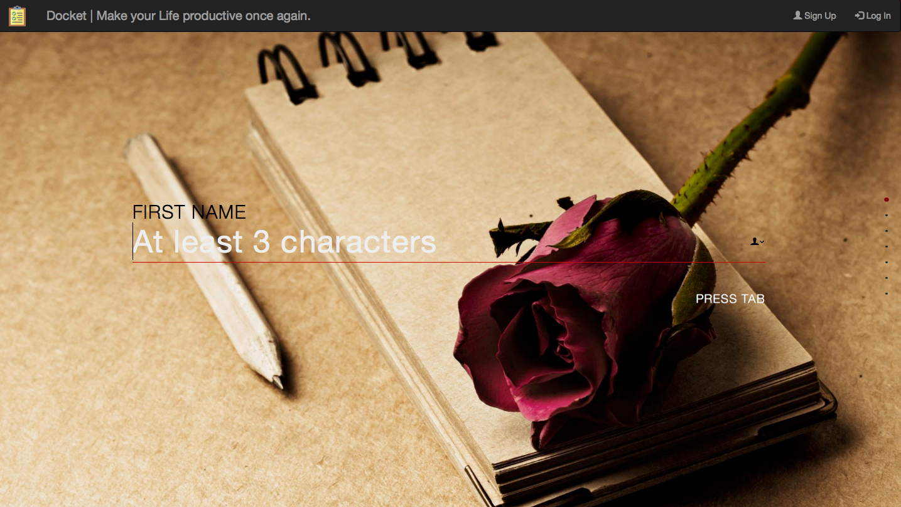
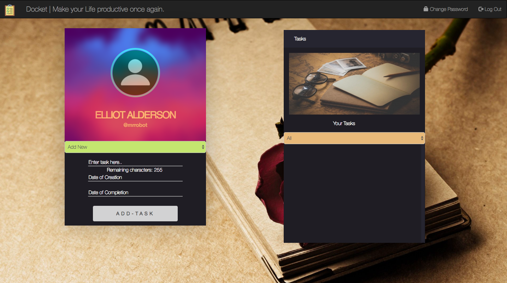

# Docket
A personalised task management system for multiple users

## Why ? 
**Almost everyone struggles to get stuff done.Period.**

There seems to be a million tasks to do, and you have no idea how to even start.Tight deadlines, annoying professors (read employers) and pesky teammates have made the job even worse. 
Result : You end up spilling the day in useless activities, brooding over your destiny at the end of the day.

You know, where the problem was ? **You weren't dead specific with what exactly you have to do.**

Hence comes **Docket** : A **personalised task management system** to help you sort your life out.

## Usage

* Create an account by filling up your details.
* Click on Login and fill up your Username and password.
* Upon successful registration and login, you will be redirected to your own portal, having your own set of tasks
* **Addition of Task** :
	* Choose genre (Add new or from an existing one)
	* Write your task (max:256 characters)
	* Choose your Date of Creation and Date of Completion from the datepicker
	* Click on "Add Task" button.

* You will find all your added tasks **by genre** in pane on the right-hand side.	
* **Editing a task** : Click on the Edit icon on the bottom-right corner of the specific task-note, and edit whatever you wantd to do.
* **Deleting a task** : Just click on the bin-shaped icon beside the edit icon.
* **You can also sort the tasks by genre**. Just select the genre from the dropdown list,just below the image on the right hand side pane.

## Issues

This is a fairly new project. There can be multiple features which can be added. If you feel like something is missing,**feel free to ping me, or open an issue**.

Have fun..!!
